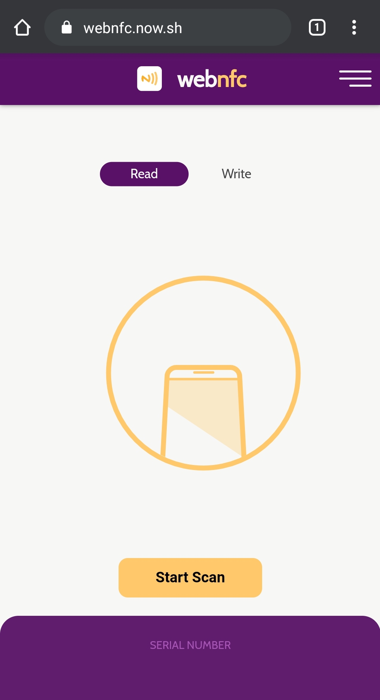
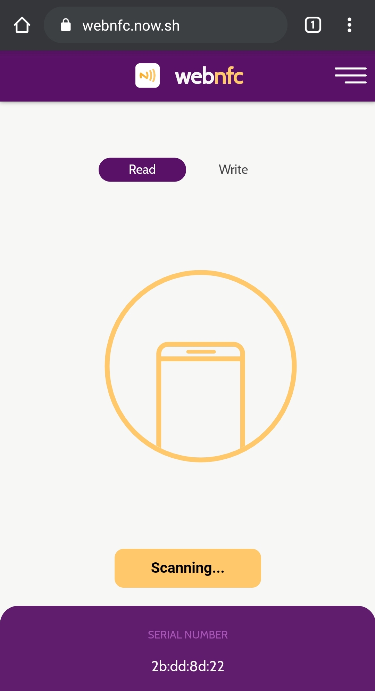

# WebNFC

[WebNFC](https://webnfc.now.sh/) is a NFC reading/writing web application that runs on the browser. Currently, this web application works on Google Chrome Beta browser from v81 onwards and Android phones with NFC capabilities.

<p float="left">
  
  
</p>
  
## Technologies

- :atom_symbol: Preact (Front-End)
- Web NFC API (By Google Chrome)

## Development

To setup the app for development on your local machine, please follow the instructions below:

1. Clone the repo to your machine

```bash
git clone https://github.com/bilafish/nfc-reader.git
```

2. Install the necessary packages

```bash
yarn install
```

3. Create a .env file in the root folder (Refer to [.env.sample](./.env.sample) as reference). You will require a token as WebNFC is a experimental feature undergoing Chrome Origin Trial. To sign up for the trial, visit the [registration page](https://developers.chrome.com/origintrials/#/trials/active).

4. Start the development environment

```bash
yarn start
```

To set up your phone for Web NFC:

1. Install the latest [Google Chrome Beta browser](https://play.google.com/store/apps/details?id=com.chrome.beta) from Google Play Store on your Android phone with NFC support.

2. Open Google Chrome Beta and go to: `chrome://flags`

3. Enable WebNFC and Experimental Web Platform features flags

4. Go to [WebNFC](https://webnfc.now.sh/) and scan away!
